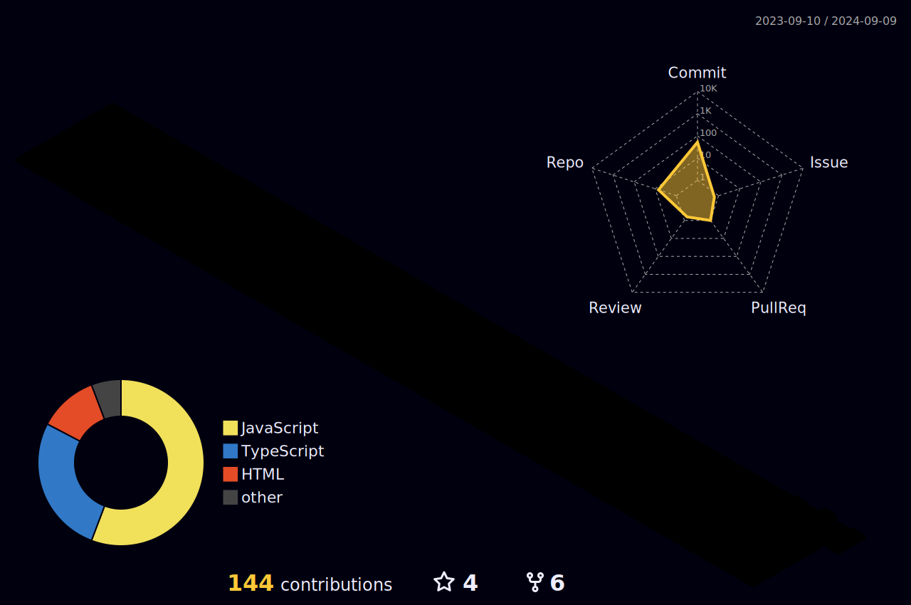

# Hi I'm Ethan

### Why do I code?

- I've always been a developer and an artist
- My hobbies have always been constructive and fulfilling through challenge
- As a developer I put all of my skills and perseverance into action
- Providing a stable life for my future family and remaining consistent is a must

 <h4 align="center">How do I do it? </h4>

  

💬 Ask me about **Software development** and Game development

 

<h4 align="left">Connect with me: </h4>
 
  

 

